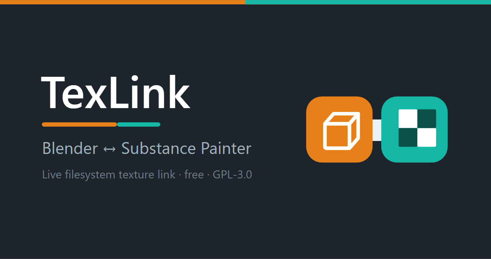
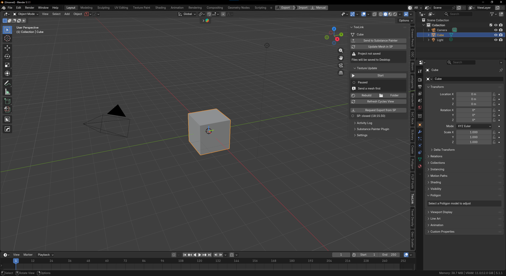
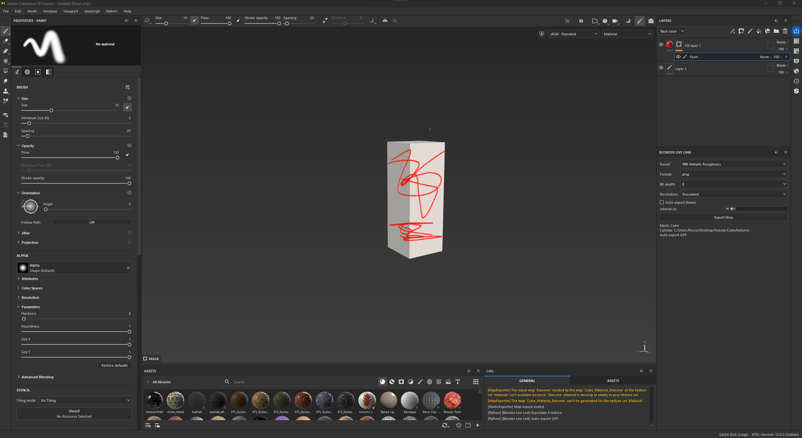

# TexLink — Blender ↔ Substance Painter

*Language: **English** · [Italiano](README.it.md)*

A filesystem-based live link between **Blender** and **Substance 3D Painter**: send your
mesh with one click, paint in SP, and Blender automatically updates the material
(Principled BSDF) whenever SP exports the textures.

- **Blender**: 4.x / 5.x (tested on 5.1)
- **Substance Painter**: standalone (tested on Adobe Substance 3D Painter 12)
- **Dependencies**: none (just `bpy` + stdlib)

---

## Demo & screenshots

▶️ **[Watch the demo video](https://github.com/Rox3DA/texlink/releases/download/v1.1.0/texlink-demo.mp4)**

| Blender | Substance Painter |
|---------|-------------------|
|  |  |

*Left: the TexLink panel in Blender (send mesh, sync textures, update geometry). Right: painting in Substance Painter with the bundled live-link plugin exporting back to Blender.*

---

## Installation

### 1) Blender add-on

**Legacy add-on** (any 4.x / 5.x):
1. `Edit → Preferences → Add-ons`
2. Top-right: `⌄ → Install from Disk…`
3. Select **`texlink.zip`**
4. Enable **"TexLink"** (appears in the `N` sidebar → **TexLink** tab)

**Extension** (Blender 4.2+, recommended): install **`texlink_extension.zip`** by
dragging it into the Blender window, or via `Preferences → Get Extensions → ⌄ → Install from Disk…`.

> Rebuild the zips after changes:
> `build_zip.ps1` (legacy) / `build_extension.ps1` (extension).

### 2) Configuration (add-on preferences)
In the panel, **Settings → Open Addon Preferences** (or `Edit → Preferences → Add-ons → TexLink`):
- **Substance Painter Executable**: path to the `.exe`
  (e.g. `C:\Program Files\Adobe\Adobe Substance 3D Painter\Adobe Substance 3D Painter.exe`)
- **Use Project Folders**: recommended ON (see below)

### 3) Substance Painter plugin
1. In the Blender panel: **Substance Painter Plugin → Install plugin in Substance Painter**
   (copies the plugin into SP's plugins folder)
2. In SP: `Python → Reload Plugins Folder`, then enable **`blender_live_link`**
3. The **Blender Live Link** panel appears in SP

---

## Workflow

1. Select a mesh in Blender → **Send to Substance Painter**
   - Exports the FBX and opens SP with the mesh loaded
   - Changed the mesh later? **Update Mesh in SP** re-exports and reloads the geometry in SP,
     keeping your paint work
2. In Blender: **Texture Update → Start** (begins watching the folder)
3. In SP: paint, then export the textures. Three ways:
   - **Export Now** (manual) from the Blender Live Link panel
   - **Auto-export (timer)**: tick the box + interval → exports on its own while you paint
   - **Request Export from SP**: a button in **Blender** that asks SP to export
4. Blender detects the textures and **rebuilds the material** within a few seconds

### File organization (Use Project Folders = ON)
```
<project.blend>/
└── TexLink/
    └── <MeshName>/
        ├── mesh/      ← FBX
        └── textures/  ← textures from SP
```
If the project is **not saved**, files go to `Desktop/TexLink/<MeshName>/`
(with a warning in the panel). With *Use Project Folders* OFF you set manual paths.

---

## Texture naming convention

The material is built from the **file names**. Recognized patterns (anywhere in the name):

| Channel    | Patterns                                  | Principled BSDF slot        |
|------------|-------------------------------------------|-----------------------------|
| Base Color | `BaseColor`, `diffuse`, `albedo`          | Base Color                  |
| Roughness  | `Roughness`, `rough`                      | Roughness                   |
| Metallic   | `Metallic`, `metalness`, `metal`          | Metallic                    |
| Normal     | `Normal`, `nrm`                           | Normal (via Normal Map)     |
| Emissive   | `Emissive`, `emission`                    | Emission Color              |
| AO         | `AO`, `ambient_occlusion`                 | multiplied over Base Color  |
| Height     | `Height`, `displacement`                  | Bump (+ Normal Map)         |
| Opacity    | `opacity`, `alpha`                        | Alpha                       |

The SP plugin names files `MeshName_TextureSet_Channel` (compatible out of the box).
**Colorspace** is read from the SP suffix when present (e.g. `_Linear Rec.709`, `_Non-Color`),
otherwise inferred from the channel.

### Multi-material
Meshes with multiple materials → multiple texture sets in SP. The add-on creates one
material per set and assigns it to the correct slot (matched by the original material name,
then kept stable via a custom property). **Note**: the channel must be the last token of
the file name.

---

## Panel reference (N sidebar → "TexLink")

- **TexLink**: active mesh + **Send to Substance Painter** + destination folder
- **Texture Update**: Start/Stop watcher, status + last update, **Rebuild**, **Folder**
  (open folder), **Refresh Cycles View**, **Request Export from SP**, SP status
- **Activity Log**: recent events + clear
- **Substance Painter Plugin**: install/update the SP plugin
- **Settings**: project-folders toggle, SP executable, interval (or Preferences)

The UI is in **English**; if you set Blender to **Italian** it translates automatically.

---

## Known limitations

- **Cycles / Material Preview**: automatic viewport refresh isn't always guaranteed
  (Blender limitation on redraw from a timer). If needed, use **Refresh Cycles View**.
- **Export on SP save**: not supported (the project is locked during save). Use Export Now,
  the timer, or Request Export from SP.
- **Material names containing channel keywords** (e.g. a material literally named "Normal")
  can confuse parsing in edge cases.

---

## Troubleshooting

- *Panel doesn't appear*: make sure the add-on is enabled in Preferences.
- *SP doesn't open*: check the executable path in Preferences.
- *Textures don't update*: is the watcher **Started**? Is the watched folder the one SP
  exports to? Try **Rebuild**.
- *Preview stuck in Cycles*: click **Refresh Cycles View**.
- *SP plugin errors*: check Substance Painter's **Log** (`Window → Views → Log`).
